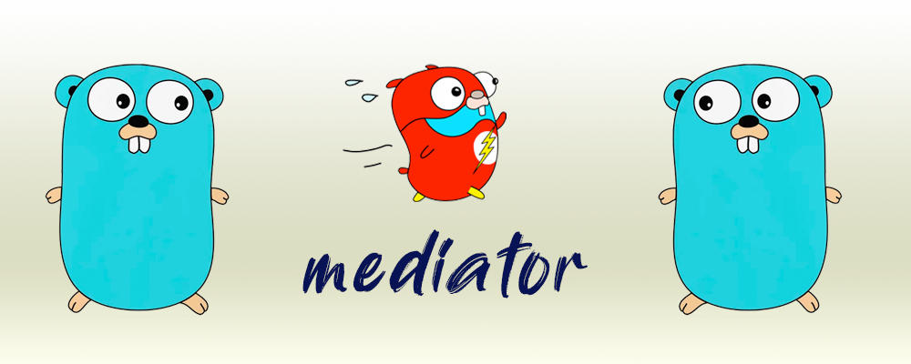

<div align="center" style="margin-bottom:20px">
  
  <div align="center">
    <a href="https://github.com/blugnu/mediator/actions/workflows/qa.yml"></a>
    <a href="https://goreportcard.com/report/github.com/blugnu/mediator" ></a>
    <a>= 1.18" src="https://img.shields.io/github/go-mod/go-version/blugnu/mediator?style=flat-square"/></a>
    <a href="https://github.com/blugnu/mediator/blob/master/LICENSE"></a>
    <a href="https://coveralls.io/github/blugnu/mediator?branch=master"></a>
    <a href="https://pkg.go.dev/github.com/blugnu/mediator"></a>
  </div>
</div>

<br/>

# mediator

A lightweight implementation of the [Mediator Pattern](https://en.wikipedia.org/wiki/Mediator_pattern) for `goLang`, inspired by [jbogard's MediatR framework for .net](https://github.com/jbogard/MediatR).

#### Project History

This project was previously known as `go-mediator`.  It was renamed as simply `mediator` to align with the package name and because all `blugnu` projects are golang; the `go-` prefix was just noise.

At the same time, the project was completely re-written and shares little more than the original concept with the previous incarnation so the release history below starts with the `mediator` rewrite.

| Release |   |   |
|---------|---|---|
| v0.1.0 | 26-Apr-2023 | Rewritten and published as `mediator` |

<br/>
<hr/>

## Mediator Pattern
[The Mediator](https://en.wikipedia.org/wiki/Mediator_pattern) is a simple [pattern](https://en.wikipedia.org/wiki/Software_design_pattern) that uses a 3rd-party (the mediator) to facilitate communication between two other parties without them requiring knowledge of each other.

It is a powerful pattern for achieving loosely coupled code.

There are many ways to implement a mediator, from simple `func` pointers to sophisticated and complex messaging systems; `blugnu/mediator` sits firmly at the *simple* end of that spectrum!

<br/>

## What (go) mediator Is NOT
- it is **not** a message queue
- it is **not** asynchronous
- it is **not** complicated!

<br/>

# How It Works

#### TL;DR

Your code calls the mediator with some request and a pointer to an expected result variable; the mediator lookups up the command that handles that request, calls it and returns the result and any error.

#### In Detail

`blugnu/mediator` maintains a registry of command handlers that respond to requests of a specific type and return a result of a specific type.

Command handlers are registered during initialising of your application or µservice or by establishing mock handlers in tests.

Command handlers are called indirectly via a generic `mediator.Execute[TRequest, TResult]` function (this function is **the mediator**).

The mediator consults the registry to identify the handler for the request type involved.  If no  handler is registered then a `NoHandlerError` is returned.

If a handler is identified but the caller and handler do not agree on the result type, a `ResultTypeError` is returned.

If the correct result type is specified, the mediator tests for an implementation of the `ConfigurationChecker` interface; if present, the command configuration is checked.  Any error returned from the `ConfigurationChecker` is wrapped in a `ConfigurationError` and returned to the caller.

If there is no `ConfigurationChecker` or is successful, the mediator then tests for an implementation of the `Validator` interface; if present, the request is validated using this interface.  Any error returned from the `Validator` is wrapped in a `ValidationError` and returned to the caller.

If there is no `Validator` interface, or the request is validated successfully, the request is passed to the command handler and the result and any error from the command are then returned to the caller.

All of this takes place _synchronously_ as direct function calls.  i.e. if the handler panics, the stack will contain a complete path of execution from the caller, thru the mediator to the corresponding handler function.

<br/>
<br/>

# Implementing a Command Handler

1. (_Optional_): Create a Package for Your Command
2. Declare request, result and handler types
3. (_Optional_) Implement the `ConfigurationChecker` interface on the handler
4. (_Optional_) Implement the `Validator` interface on the handler
5. Implement the `CommandHandler` interface on the handler

> 1. There are numerous advantages to implementing each command in its own package.  See [Packaged Commands](.docs/packaged-commands.md) for more details.

> 3. If your handler requires configuration such as an injected repository or other dependencies, consider implementing the `ConfigurationChecker` interface.  See [Handler Configuration Checks](.docs/handler-configuration-checks.md) for more information.

> 4. Any request validation is recommended to be performed in a `Validate` function, implementing the `Validator` interface.  See [Request Validation](.docs/request-validation.md) for more information.

6. Register the command handler, e.g.:

```golang
    mediator.RegisterCommand[getFoo.Request, *getFoo.Result](&getFoo.Handler{Repository: r})
```

<br/>

# Calling a Command Using `mediator`

The `mediator.Execute` function accepts a pointer to a value to receive the result of a command _and_ it returns the _same_ result value.

As a consequence, there are two ways to call `mediator.Execute`:

1. Pass an anonymous pointer and receive the returned result value
2. Pass the address of a variable to receive the result and discard the returned value

#### Receiving the Returned Result

```golang
    rq := getFoo.Request{Id: id}
    rs, err := mediator.Execute(ctx, rq, new(*getFoo.Result))
```

#### Discarding the Returned Result

```golang
    rq := getFoo.Request{Id: id}
    rs := &getFoo.Result{}
    _, err := mediator.Execute(ctx, rq, &rs)
```

You can of course do both simultaneously.

Ordinarily this could be confusing (potentially leading to two copies of the result), but there is one special case where it is _positively useful_: Commands that return _no result_.

## Commands Returning No Result

For commands that have no result value a special type is provided: `mediator.NoResult`

A command that specifically has no result value can specify a result of this type.

When calling such a command, pass an anonymous pointer of this type **_and_** discard the returned value:

```golang
    rq := deleteFoo.Request{Id: id}
    _, err := mediator.Execute(ctx, rq, new(mediator.NoResult))
```


<br/>

# Testing With Mediator

The loose-coupling that can be achieved with a mediator has obvious utility when it comes to testing code.

Most obviously it enables code under test to make requests that are handled by *test* handlers, rather than *production* handlers, without the code under test having to do anything to achieve this or even being aware that it is happening!


## Mock Command Handlers
You can implement test `Receiver` and `Handler` implementations as needed.  But, out-of-the-box, `blugnu/mediator` provides mocks that can be used in most - if not all - common use cases. 

Factory funcs are provided to create mocks simulating specific return values (including errors) and/or to determine how many times a handler is called and with what data or requests, during execution of code under test.

The mocks returned by these factories provide a `Remove()` method which _must_ be deferred to ensure the mock handler is deregistered when the test has completed.

For example, to fake a `getFoo` command that returns a zero-value result and indicates successful completion for _any and all_ requests it receives:

```go
    mock := mediator.MockCommand[getFoo.Request, getFoo.Result]()
    defer mock.Remove()
```

The other factory functions are:

```golang
    // Mocks a command handler returning a specific result and nil error
    MockCommandResult[TRequest, TResult](result TResult) *mockcommand[TRequest, TResult]

    // Mocks a command handler returning a specific error
    MockCommandError[TRequest, TResult](error) *mockcommand[TRequest, TResult]

    // Mocks a command handler returning an error from an implementation
    // of the Validator interface
    MockCommandConfigurationError[TRequest, TResult](error) *mockcommand[TRequest, TResult]

    // Mocks a command handler returning an error from an implementation
    // of the ConfigurationChecker interface
    MockCommandValidationError[TRequest, TResult](error) *mockcommand[TRequest, TResult]
```

